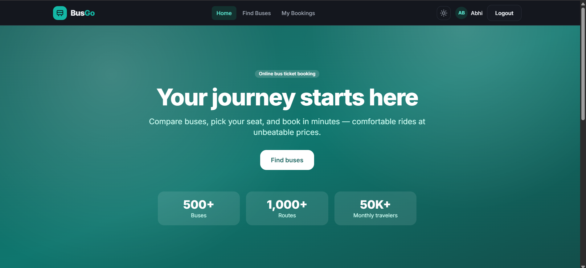
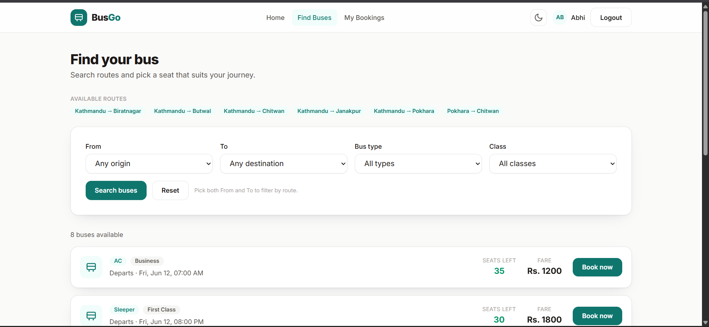

# Bus Ticket Booking System

### Project Idea Summary

This project is a learning project I built to explore the requirements and functionality of a bus ticket booking platform. It includes multiple API sections, such as `/admins`, which contains all admin-related APIs, `/users`, which handles user and authentication APIs, and `/bookings`, which covers all bus seat booking APIs. For more detailed information refer to the Postman API documentation.

---





### Tech Stack Summary

This project runs on the latest versions of the listed dependencies defined in the project's `package.json` file.

- **Package Manager:** npm  
- **Frontend:** TypeScript, ReactJs 
- **Backend:** TypeScript, NestJS 
- **Database:** Prisma ORM, PostgreSQL  
- **Cloud Storage:** Cloudinary  
- **Data Validation:** Zod  
- **Email Sender:** Nodemailer  
- **PDF Builder:** PDFKit  
- **Encoding & Decoding:** Argon2  
- **Authentication:** Session-based JWT  

---

### How to Use

#### 1. Clone the Repository

```bash
git clone https://github.com/sandesh-sapkota/online-bus-ticket-booking-system
cd online-bus-ticket-booking-system
```

#### 2. Install Dependencies
```bash
npm install
```

#### 3. Set Up ENV Variables

```bash
Copy all variables from .env.sample
Create a new .env file in the root directory
Paste all variables and fill in required values
```

#### 4. Set Up Prisma ORM

After configuring database credentials, run:

```bash
npx prisma migrate dev
```

#### 5. Run the Project
```bash
 npm run start:dev
 ```